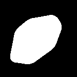
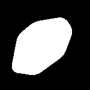
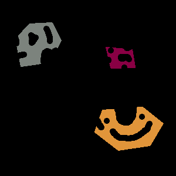
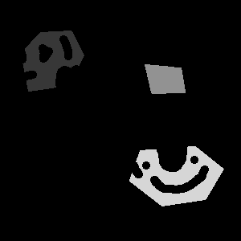
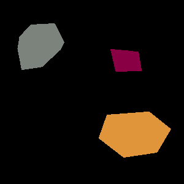

[](./LICENSE)

# itkBinaryConvexHullFilter

## Description

This is a set of ITK filters that compute the convex hull mask from a binary or label input image, using the quick-hull algorithm.
The main usage of this filter is to propose a quick, simple, and parameter free filter to clean object segmentation applied on convex shape object such as cell nucleus.

## Requirement

(Minimum)  
[Insight ToolKit (ITK)](https://itk.org/) += 5.0  
[CMake](https://cmake.org/) += 3.0  

 ## itkBinaryImageToConvexHullFilter

The filter inherit from ImageToImageFilter and take in input an nD binary or labelled image and return the corresponding convex hull. By default, the filter will consider all pixel which is not the background (=0) to compute the convex hull.
In the case of a labelled image, it is possible to define the **LabeValue** to identify a specific label object in the input to process. In this case it is also possible to provide the **LabelIndices** and/or provide the object region using the **filter->GetOutput()->SetRequestedRegion(ObjectRegion)** to optimise the computation time. Both indices and region can be computed by the **itkLabelGeometryImageFilter** from the ITK library.

## itkLabelImageToConvexHullFilter

The filter apply the itkBinaryImageToConvexHullFilter for each label in the input image automatically. It is possible to pass a **LabelFilter** which provide label id and pixel indices and region for each object to speed up the process. By default, an **itkLabelGeometryImageFilter** is expected, but not mandatory.

## Install

```
git clone https://github.com/StRigaud/itkConvexHull2D.git  
mkdir itkConvexHull2D/build  
cd itkConvexHull2D/build  
ccmake -DCMAKE_BUILD_TYPE=Release ..  
make  
make test  
```

All tests should pass sucessfully.

## Usage

See **itkBinaryImageToConvexHullFilterTest** and **itkBinaryImageToConvexHullFilterTest2** for example on how to use the itkBinaryConvexHullFilter.
See **itkLabelImageToConvexHullFilterTest** for example on how to use the itkLabelImageToConvexHullFilter.

## Examples

| Input  | Output | GroundTruth |
| :--------:  | :--------: |  :--------: |
|  |  |  |
|  |  |  |
|  |  |  |
